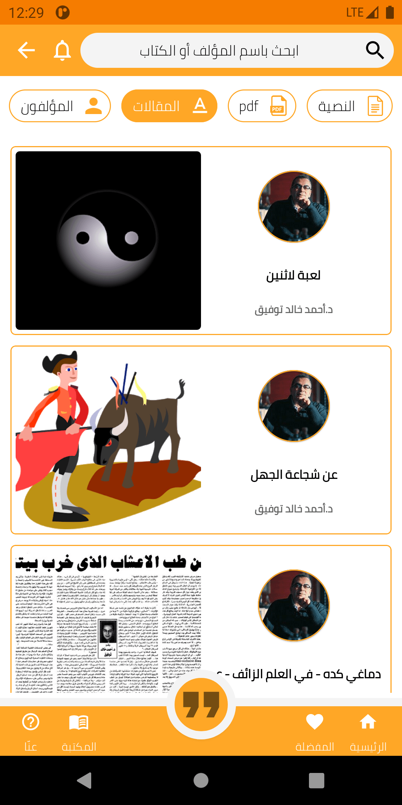

<div align="center">
  <a href="https://play.google.com/store/apps/details?id=com.ma7moud3ly.makeyourbook" target="_blank">
    
  </a>

# [Make Your Book اصنع كتابك](https://play.google.com/store/apps/details?id=com.ma7moud3ly.makeyourbook)
```
Make Your Book : The largest library for arabic books and novels in text format (non scanned books).
أكبر مكتبة عربية للكتب و الروايات النصية الغير  مصورة
```


<div align="center">
 <h3>Mobile View</h3>
<br>
  <div>
  
  
  
</div>
<br>
<div>
  
  
  
</div>
<br>
<br>
 <h3>Tablet View</h3>
<br>
<br>
<div>
  
  
  
</div>
<br>
<div>
  
  
  
</div>
<br>


</div><div align="left">
  
### Technologies:
<li>Java</li>
<li>MVVM architecture</li>
<li>Data Binding and Live Data</li>
<li>Room Database</li>
<li>Firebase Storage</li>
<li>Material components</li>

### Third parties:
- Glide
- PhotoView
- Colorpicker
- Gson

### Features
<div align="left">
With 'Make your Books اصنع كتابك'
<li>You can find your prefered book/novel within thouthands of text books.</li>
<li>Text Books means that you can change the style/format of the book as you need with clear font and great reading experince.</li>
<li>Make your Books has a Quote Designer where you can navigate many templates and designs to create, save and share your great quotes.</li>
</div>
<div align="center">
<br>
<div>

<br>
[Download](https://play.google.com/store/apps/details?id=com.ma7moud3ly.makeyourbook)
</div>
